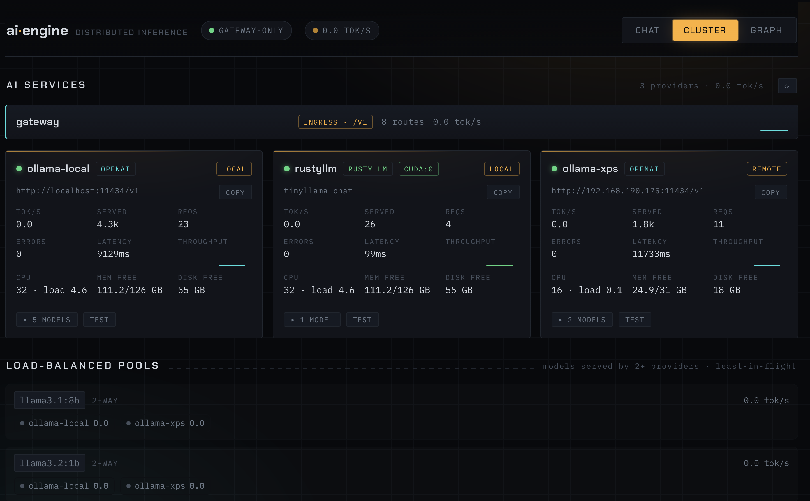
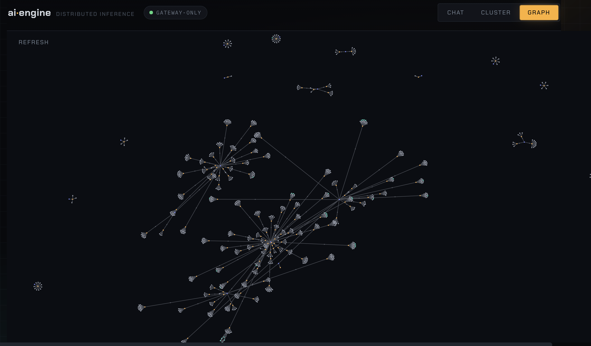

# ai-engine

A single-binary LLM inference engine in Rust. It is three things at once:

1. **A drop-in OpenAI / Anthropic gateway** — proxy traffic to remote APIs or any
   OpenAI-compatible server (Ollama, vLLM, LM Studio, OpenRouter), with load
   balancing, failover, and LAN auto-discovery.
2. **A local inference server** — run quantized models directly on CPU/CUDA/Metal
   via candle, or stream large models on small GPUs via rustyllm.
3. **A distributed-inference cluster** — partition a model across machines over
   QUIC, including a **leaderless p2p mode** where any node can ingest a request
   and coordinate the forward pass over a full mesh.

It ships with an embedded React telemetry UI (live throughput, per-provider
stats, a realtime GPU panel, a cluster-architecture force graph, and a knowledge
graph) served from the same binary.



> The Cluster view: per-provider cards with live tok/s, requests/errors/latency,
> health and device awareness (note the in-process `rustyllm` provider on
> `cuda:0`), plus load-balanced pools for models served by multiple providers.



## Quickstart

```bash
# Build (gateway + cluster; local backends are opt-in features, see below)
cargo build --release

# Configure from the example, then run
cp ai-engine.toml.example ai-engine.toml
$EDITOR ai-engine.toml
./target/release/ai-engine --config ai-engine.toml

# Validate config and exit
./target/release/ai-engine --check --config ai-engine.toml
```

Point any OpenAI SDK at `http://localhost:<port>/v1`:

```bash
curl http://localhost:8080/v1/chat/completions \
  -H "Content-Type: application/json" \
  -d '{"model": "llama3.2:1b", "messages": [{"role": "user", "content": "hi"}]}'
```

## Provider kinds

A provider is one `[[provider]]` block routed to by one or more `[[route]]`
rules. Five kinds:

| `kind` | What it is | Notes |
|---|---|---|
| `openai` | Any OpenAI-compatible HTTP upstream | OpenAI, Ollama, vLLM, LM Studio, OpenRouter |
| `anthropic` | Anthropic Messages API | routed only from `/v1/messages` |
| `candle` | In-process quantized local inference | GGUF (Q4_0/Q4_1/Q6_K…), CPU/CUDA/Metal; paged continuous batching |
| `rustyllm` | In-process layer-streaming inference | HF safetensors; runs large models on small GPUs |
| `local-cluster` | Distributed inference over a QUIC cluster | pipeline-parallel; leader/worker or leaderless |

### Local inference (candle)

```toml
[[provider]]
id = "llama-gpu"
kind = "candle"
weights_path = "/models/Llama-3.2-1B-Instruct-Q4_0.gguf"
device = "auto"          # auto | cpu | cuda:N | metal
engine = "paged"         # "paged" (continuous batching) | "pool"

[[route]]
match = { model = "llama-3.2-1b" }
provider = "llama-gpu"
```

Build with the candle backend (CPU by default; CUDA needs the nvcc toolkit):

```bash
cargo build --release --features backend-candle        # CPU/Metal
cargo build --release --features backend-candle-cuda   # CUDA
```

### Local inference (rustyllm)

Layer-streaming engine for running large models on limited GPU memory. Loads an
HF-safetensors **model directory** (config.json + tokenizer.json + *.safetensors):

```toml
[[provider]]
id = "rustyllm"
kind = "rustyllm"
weights_path = "/models/tinyllama-chat"   # a directory, not a .gguf
device = "cuda:0"                          # auto | cpu | cuda:N | metal
```

```bash
cargo build --release --features backend-rustyllm        # CPU
cargo build --release --features backend-rustyllm-cuda   # CUDA
```

### Gateway with Ollama + LAN discovery + load balancing

Ollama exposes an OpenAI-compatible API and needs no key. Set `[discovery]` to
auto-register Ollama instances advertised on the LAN via mDNS; when two providers
serve the same model they form a least-in-flight load-balanced pool with failover.

```toml
[discovery]
ollama_mdns = true
timeout_secs = 8

[[provider]]
id = "ollama-local"
kind = "openai"
base_url = "http://localhost:11434/v1"

[[route]]
match = { model = "llama3.2:1b" }
provider = "ollama-local"
```

## Distributed inference

Partition one model across machines over QUIC with fingerprint-pinned TLS. Two
modes:

### Leader/worker

The leader speaks HTTP and drives the pipeline; workers serve their assigned
layer range. Capability-aware DP layer-cut partitioning, or an explicit
`[[cluster.partition_override]]`.

```toml
[[cluster]]
id = "home"
leader = "node-a"
quic_bind = "0.0.0.0:7700"

[cluster.model]
id = "llama-3-70b"
weights_path = "/srv/models/llama-3-70b/model.gguf"   # GGUF is self-describing

[[cluster.node]]
id = "node-a"
addr = "192.168.1.10:7700"
cert_fingerprint = "sha256:..."   # printed to stderr on first start
backend = "cuda"

[[cluster.node]]
id = "node-b"
addr = "192.168.1.11:7700"
cert_fingerprint = "sha256:..."
backend = "metal"

[[provider]]
id = "home-cluster"
kind = "local-cluster"
cluster = "home"

[[route]]
match = { model = "llama-3-70b" }
provider = "home-cluster"
```

Run on each node:

```bash
./ai-engine --config ai-engine.toml --node-id <this-node-id>
```

`[cluster.discover]` enables mDNS so nodes find each other without pasting
fingerprints.

### Leaderless p2p

Set `leaderless = true` on the cluster. Every node forms a full QUIC mesh,
independently derives the same partition manifest (deterministic, content-hashed —
agreement without a coordinator), serves its hosted stages, and runs a local
coordinator. **Any node** can accept a chat request and drive the forward pass:
token ids go to the embedding host, logits come back from the output host, both
of which may be other nodes.

```toml
[[cluster]]
id = "home"
leaderless = true
# … nodes + partition_override as above; each node also gets an HTTP bind
```

## Web UI

The binary embeds a React UI (Vite, compiled in via rust-embed) served at the
HTTP bind address: streaming Chat, a Cluster dashboard (per-provider live tok/s
sparklines, requests/errors/latency, health, device awareness, a realtime
nvidia-smi GPU panel, and a force-graph of the request/cluster architecture), and
a Graph view (a knowledge graph over cluster nodes, sessions, memories, commands).

Rebuild the UI before the release binary (it is embedded at compile time):

```bash
cd web && npm install && npm run build   # emits into crates/ai-engine-web/assets/
cargo build --release                    # embeds the built assets
```

## Architecture

```
HTTP request → [axum extractors] → RequestCtx → [Pipeline.execute]
   1. AuthStage           validates bearer; sets identity
   2. ContentPolicyStage  max_request_bytes + injection regexes
   3. ModelRouteStage     model → provider binding (+ load balancing)
   4. ForwardStage        Provider::chat / chat_stream / messages
   5. LogStage [terminal] one JSON line + metrics + activity graph
→ [axum response] (JSON or SSE)
```

- **Pipeline.** Stages return `Continue`, `Respond`, or `Err`; terminal stages
  always run, so every request emits exactly one log line. Stages are
  trait-based and configured per route from TOML.
- **Provider trait** (`ai-engine-provider`). Default methods return
  `Unsupported`; a provider implements only what it serves. All five kinds plug
  in behind this one trait.
- **Format-pinning.** `/v1/chat/completions` routes to OpenAI-shape providers;
  `/v1/messages` to Anthropic.
- **Config.** TOML with `${ENV}` interpolation and SIGHUP hot-reload.

## Workspace

| Crate | Responsibility |
|---|---|
| `ai-engine` | binary: CLI, role resolution, app wiring, signals, hot reload |
| `ai-engine-core` | `Pipeline`, `Stage`, `RequestCtx`, metrics, health, gpu, activity |
| `ai-engine-provider` | `Provider` trait + OpenAI/Anthropic wire types |
| `ai-engine-openai` / `-anthropic` | remote HTTP providers |
| `ai-engine-candle` | candle-backed local provider (paged continuous batching) |
| `ai-engine-rustyllm` | rustyllm layer-streaming local provider |
| `ai-engine-runtime` | burn-based model loading (safetensors + GGUF), quant, tokenizer |
| `ai-engine-cluster` | QUIC transport, partitioning, leader/worker + leaderless p2p |
| `ai-engine-stages` | auth, content_policy, model_route, forward, log |
| `ai-engine-config` | TOML schema, `${ENV}` interpolation, validation |
| `ai-engine-http` | axum router, SSE, `/cluster/*` + `/gateway/metrics` endpoints |
| `ai-engine-web` | embedded React UI assets |
| `ai-engine-graph` | knowledge-graph scan |
| `ai-engine-tokenizer` | tokenizer abstraction |

## Testing

```bash
cargo test --workspace

# Heavy, real-process / real-model gates are #[ignore]d, e.g.:
cargo build --release -p ai-engine
cargo test -p ai-engine --test multiproc_smoke_gguf     -- --ignored --nocapture  # leader/worker cluster
cargo test -p ai-engine --test multiproc_smoke_anynode  -- --ignored --nocapture  # leaderless any-node ingress
```

## License

[PolyForm Noncommercial License 1.0.0](LICENSE). Source-available: any
**noncommercial** use, modification, and distribution is permitted. **Commercial
use requires a separate license** — contact the author.
